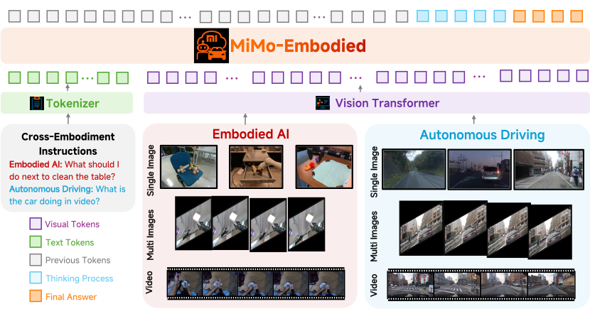

  

## I. Introduction

**MiMo-Embodied**, a powerful cross-embodied vision-language model that shows state-of-the-art performance in both **autonomous driving** and **embodied AI tasks**, the first open-source VLM that integrates these two critical areas, significantly enhancing understanding and reasoning in dynamic physical environments.

  

## II. Model Capabilities

  

## III. Model Details

  

## IV. Evaluation Results

MiMo-Embodied demonstrates superior performance across **17 benchmarks in three key embodied AI capabilities: Task Planning, Affordance Prediction, and Spatial Understanding**, significantly surpassing existing open-source embodied VLM models and rivaling closed-source models.
Additionally, MiMo-Embodied excels in **12 autonomous driving benchmarks across three key capabilities: Environmental Perception, Status Prediction, and Driving Planning**—significantly outperforming both existing open-source and closed-source VLM models, as well as proprietary VLM models.

### Embodied AI Benchmarks

####  Affordacne & Planning

  

#### Spatial Understanding

  

### Autonumos Driving Benchmarks

#### Single-View Image & Multi-View Video

  

#### Multi-View Image & Single-View Video

  

> Results marked with \* are obtained using our evaluation framework.

## V. Case Visualize

### Embodied AI

#### Affordacne Prediction

  

#### Task Planning

  

#### Spatial Understanding

  

### Autonumos Driving

#### Environmental Perception

  

#### Status Prediction

  

#### Driving Planning

  

### Real-world Tasks

#### Emobodied Navigation

  

#### Emobodied Manipulation

  

