<div align="center">
  
</div>

<br/>

<div align="center" style="line-height: 1;">
  |
  <a href="https://huggingface.co/XiaomiMiMo/MiMo-Embodied-7B" target="_blank">🤗 HuggingFace</a>
  &nbsp;|
  <a href="https://arxiv.org/abs/2511.16518" target="_blank">📔 Technical Report</a>
  &nbsp;|
  <br/>
</div>

## I. Introduction

**MiMo-Embodied**, a powerful cross-embodied vision-language model that shows state-of-the-art performance in both **autonomous driving** and **embodied AI tasks**, the first open-source VLM that integrates these two critical areas, significantly enhancing understanding and reasoning in dynamic physical environments.

<div align="center">
  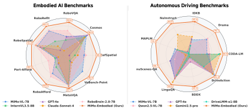
</div>


## II. Model Capabilities

<div align="center">
  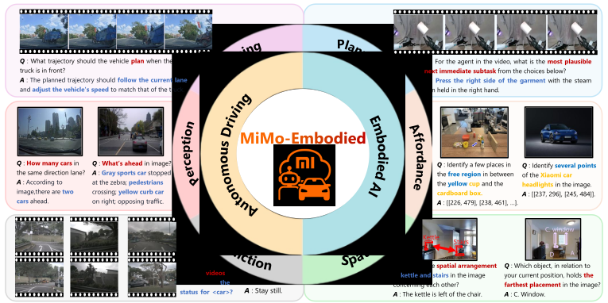
</div>

## III. Model Details

<div align="center">
  
</div>

## IV. Evaluation Results

MiMo-Embodied demonstrates superior performance across **17 benchmarks in three key embodied AI capabilities: Task Planning, Affordance Prediction, and Spatial Understanding**, significantly surpassing existing open-source embodied VLM models and rivaling closed-source models.

Additionally, MiMo-Embodied excels in **12 autonomous driving benchmarks across three key capabilities: Environmental Perception, Status Prediction, and Driving Planning**—significantly outperforming both existing open-source and closed-source VLM models, as well as proprietary VLM models.

Moreover, evaluation on **8 general visual understanding benchmarks** confirms that MiMo-Embodied retains and even strengthens its general capabilities, showing that domain-specialized training enhances rather than diminishes overall model proficiency.

### Embodied AI Benchmarks

####  Affordance & Planning

<div align="center">
  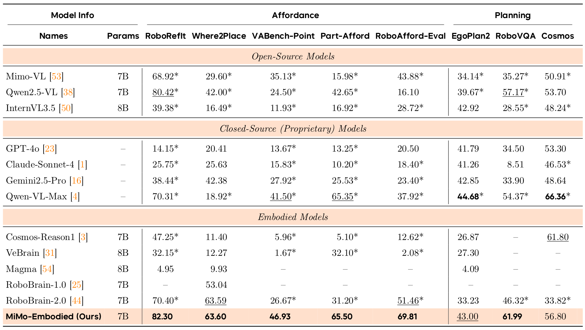
</div>

#### Spatial Understanding

<div align="center">
  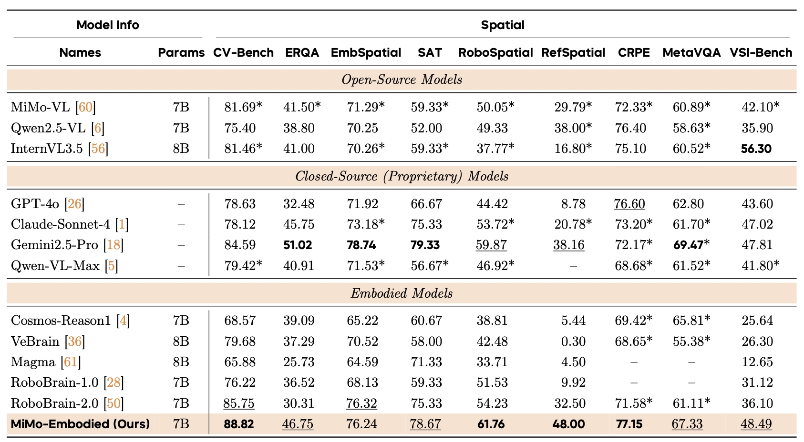
</div>


### Autonomous Driving Benchmarks

#### Single-View Image & Multi-View Video

<div align="center">
  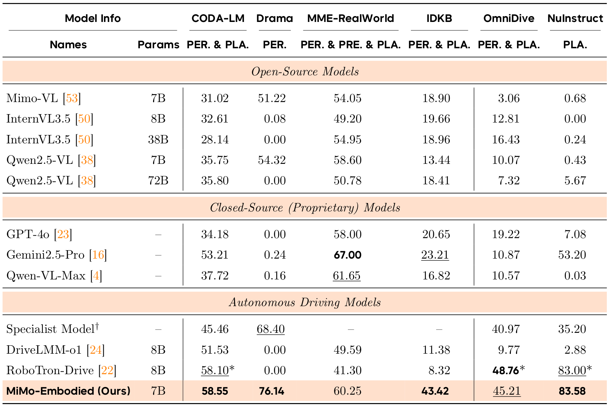
</div>


#### Multi-View Image & Single-View Video

<div align="center">
  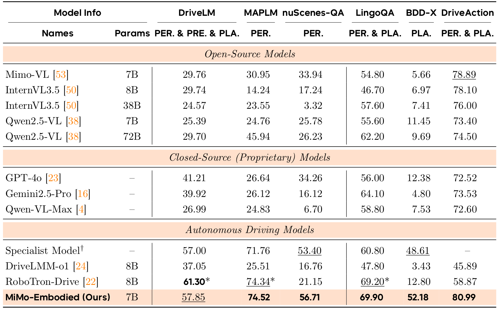
</div>

### General Visual Understanding Benchmarks

<div align="center">
  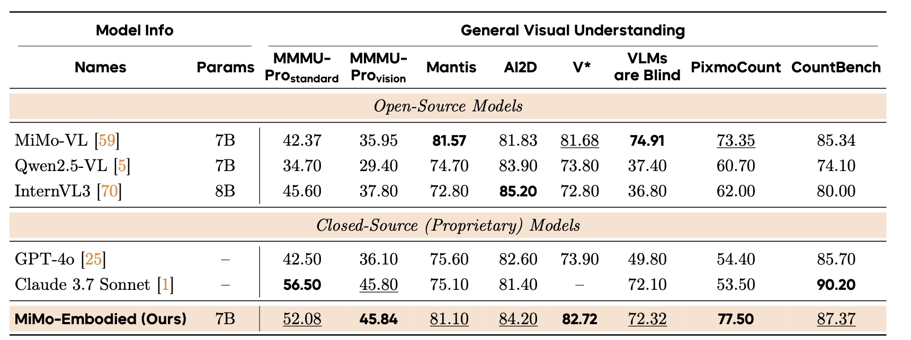
</div>

> Results marked with \* are obtained using our evaluation framework.


## V. Case Visualize

### Embodied AI

#### Affordance Prediction

<div align="center">
  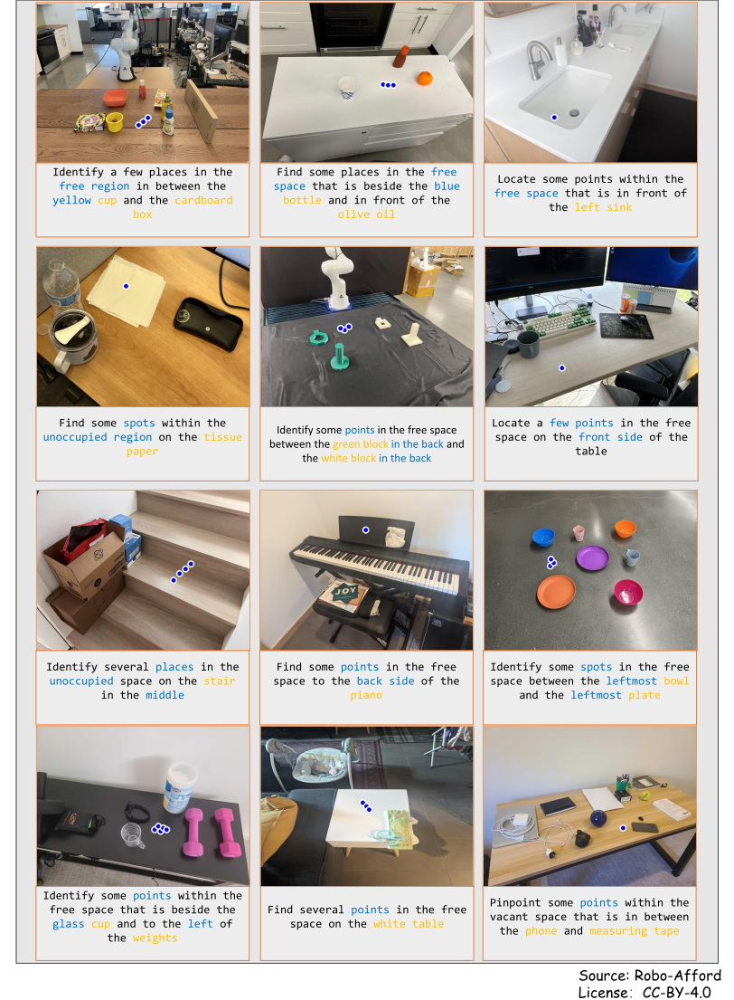
</div>

#### Task Planning

<div align="center">
  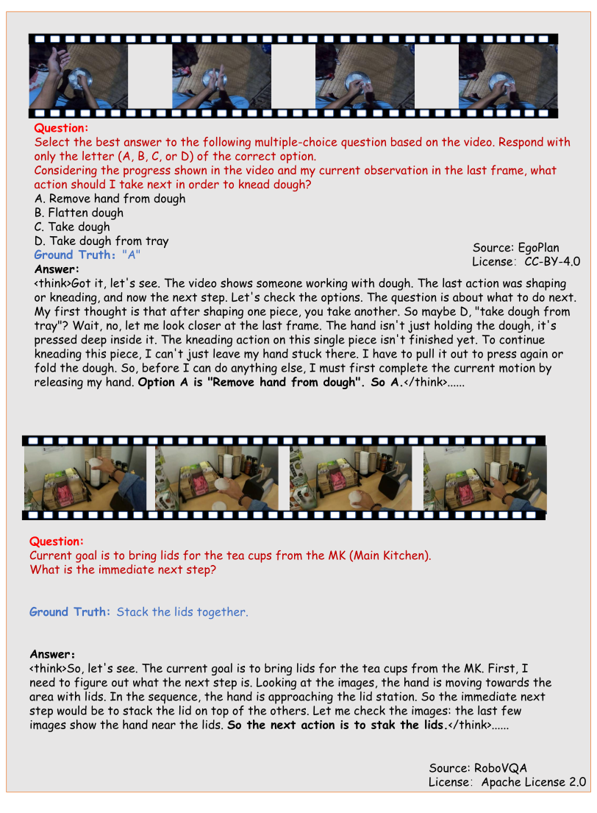
</div>

#### Spatial Understanding

<div align="center">
  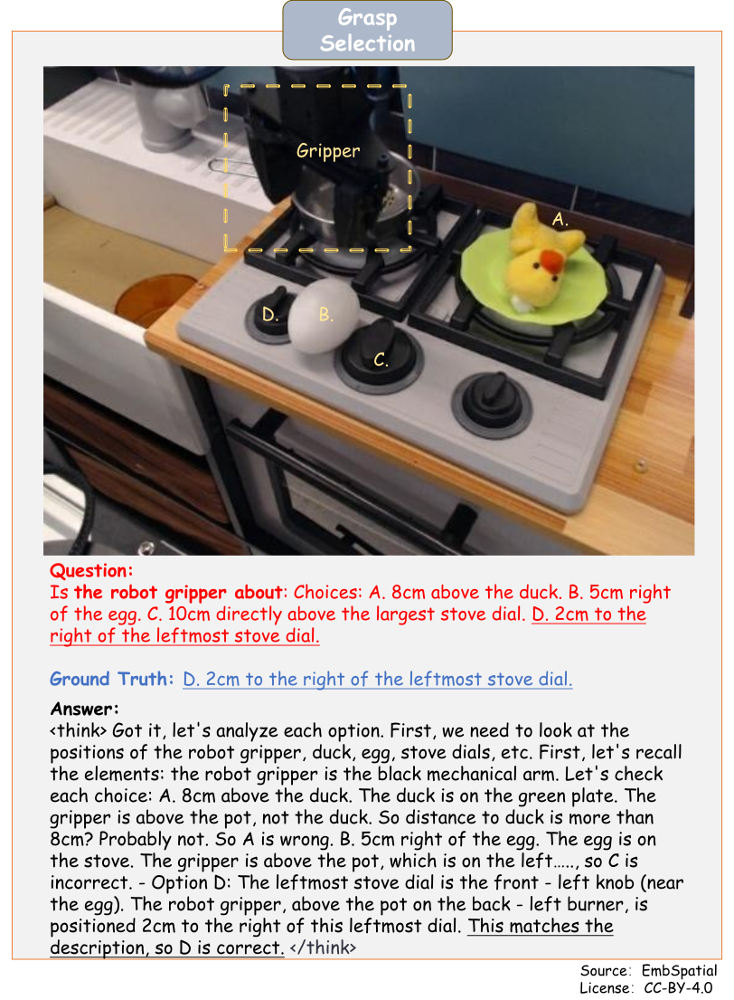
</div>

### Autonomous Driving

#### Environmental Perception

<div align="center">
  
</div>

#### Status Prediction

<div align="center">
  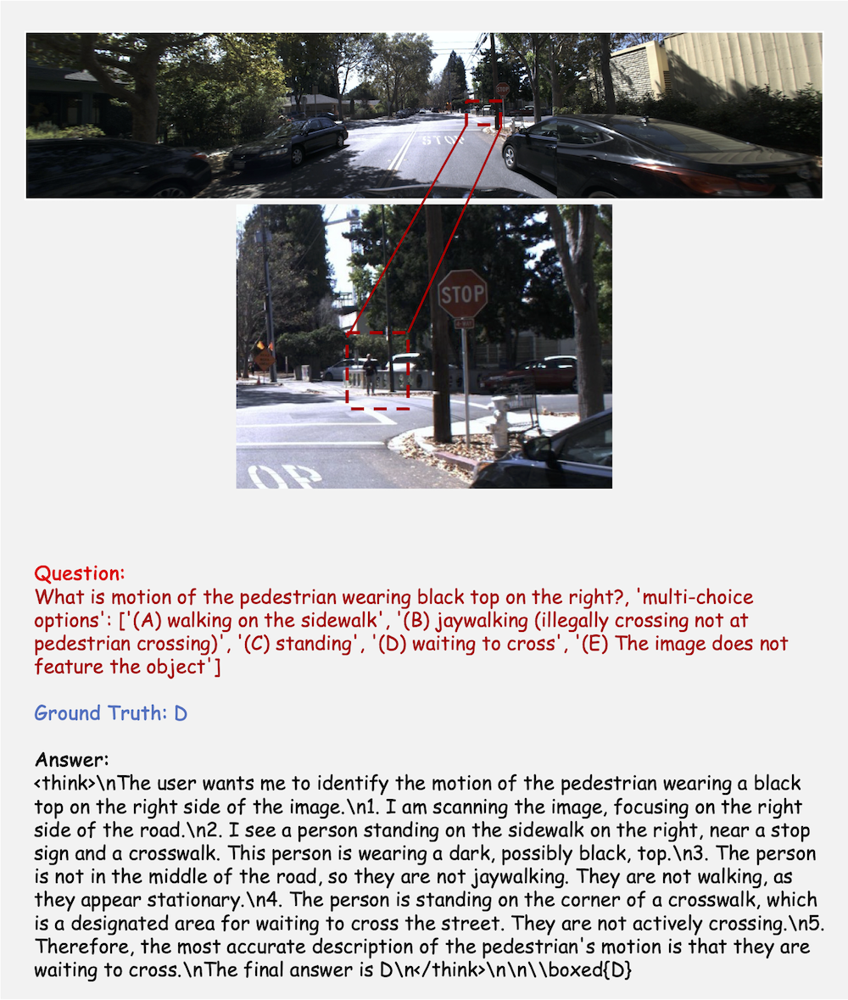
</div>

#### Driving Planning

<div align="center">
  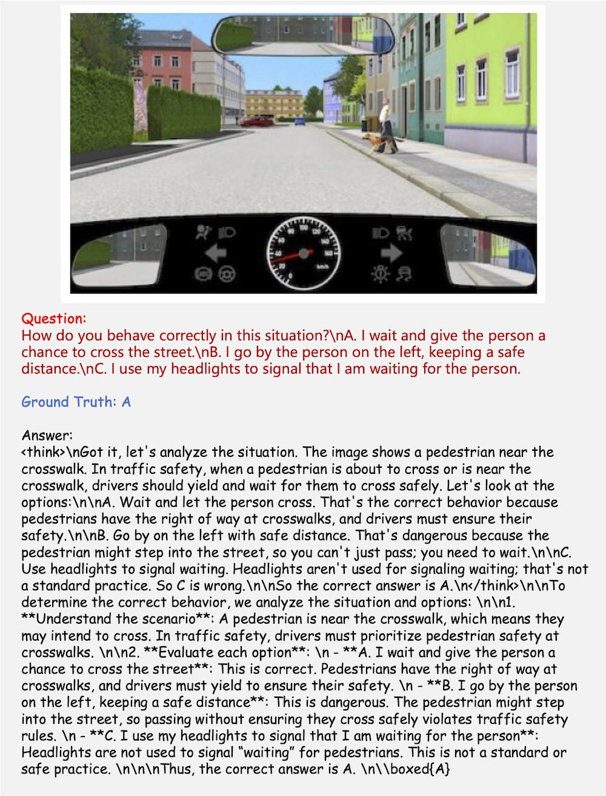
</div>

### Real-world Tasks

#### Embodied Navigation

<div align="center">
  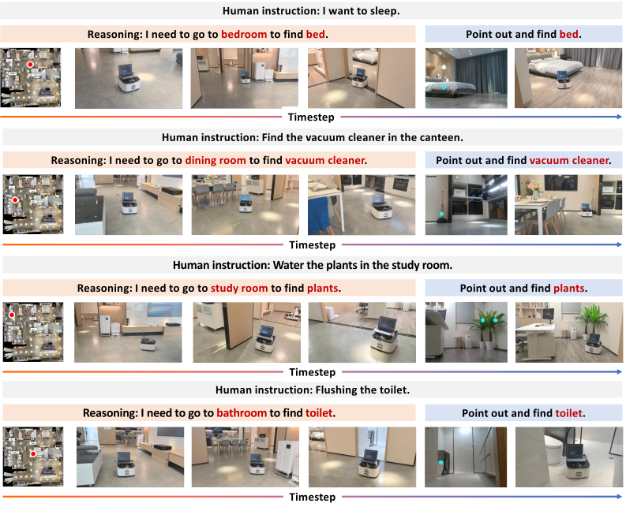
</div>

#### Embodied Manipulation

<div align="center">
  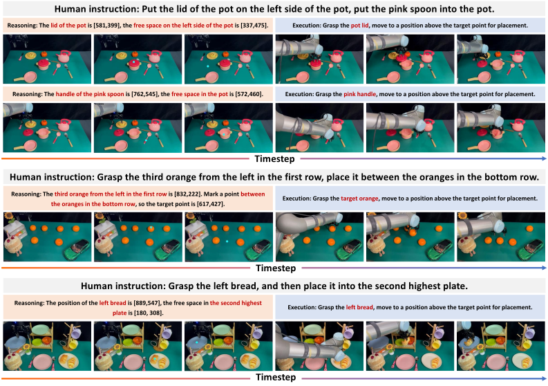
</div>


## VI. Citation

```bibtex
@misc{hao2025mimoembodiedxembodiedfoundationmodel,
      title={MiMo-Embodied: X-Embodied Foundation Model Technical Report}, 
      author={Xiaomi Embodied Intelligence Team},
      year={2025},
      eprint={2511.16518},
      archivePrefix={arXiv},
      primaryClass={cs.RO},
      url={https://arxiv.org/abs/2511.16518}, 
}
```