<div align="center">
  
</div>

<br/>

<div align="center" style="line-height: 1;">
  |
  <a href="https://huggingface.co/XiaomiMiMo/MiMo-Embodied-7B" target="_blank">🤗 HuggingFace</a>
  &nbsp;|
  <a href="https://arxiv.org/abs/2511.16518" target="_blank">📔 Technical Report</a>
  &nbsp;|
  <a href="https://github.com/XiaomiMiMo/MiMo-Embodied" target="_blank">🏠 Model Repository</a>
  &nbsp;|
  <br/>
</div>

## I. Introduction

This repository provides the **official evaluation suite of MiMo-Embodied**, designed to support **rigorous** and **reproducible** evaluation for **embodied AI** and **autonomous driving** tasks.

Built on top of the excellent [lmms-eval](https://github.com/EvolvingLMMs-Lab/lmms-eval) framework, this repository extends the evaluation pipeline with MiMo-specific model integration, benchmark support, and evaluation workflows for embodied and driving scenarios.

**MiMo-Embodied** is a powerful cross-embodied vision-language model that demonstrates state-of-the-art performance in both **autonomous driving** and **embodied AI tasks**, representing the first open-source VLM that integrates these two critical areas.

> This repository is for **evaluation only**. It does **not** contain model training code.

<div align="center">
  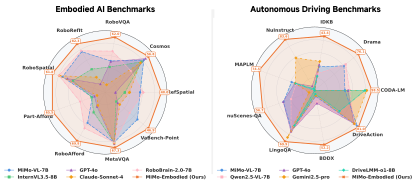
</div>

---

## II. Key Features

### 1. `MiVLLM`: A MiMo-tailored vLLM-based Model Wrapper

We use a custom `mivllm` model class built on top of the original `VLLM` implementation in `lmms-eval`, tailored for MiMo models. Compared with the default implementation, it:

- improves **data loading efficiency**
- enables finer control over **image and video preprocessing**
- supports MiMo-specific inference settings such as:
  - `max_model_len`
  - `gpu_memory_utilization`
  - `max_num_seqs`

### 2. Evaluation for Embodied AI

This evaluation suite supports embodied AI benchmarks covering key capabilities such as:

- **affordance prediction**
- **task planning**
- **spatial understanding**

### 3. Evaluation for Autonomous Driving

This evaluation suite also supports autonomous driving benchmarks covering key capabilities such as:

- **environmental perception**
- **status prediction**
- **driving planning**
- **driving knowledge-based QA**

### 4. Flexible Evaluation Workflows

The framework supports:

- **single-GPU** evaluation
- **multi-GPU** evaluation
- **multi-node** distributed evaluation
- **batch evaluation** across multiple tasks

---

## III. Benchmark Coverage

This repository focuses on the evaluation of **embodied AI** and **autonomous driving** tasks.

### Embodied AI Benchmarks

| Category | Benchmarks |
|---|---|
| Affordance & Planning | `Where2Place` (`where2place_point`), `RoboAfford-Eval` (`roboafford`), `Part-Afford` (`part_affordance`), `RoboRefIt` (`roborefit`), `VABench-Point` (`vabench_point_box`) |
| Planning | `EgoPlan2` (`egoplan`), `RoboVQA` (`robovqa`), `Cosmos` (`cosmos_reason1_boxed`) |
| Spatial Understanding | `CV-Bench` (`cvbench_boxed`), `ERQA` (`erqa_boxed`), `EmbSpatial` (`embspatialbench`), `SAT` (`sat`), `RoboSpatial` (`robospatial`), `RefSpatial` (`refspatialbench`), `CRPE` (`crpe_relation`), `MetaVQA` (`metavqa_eval`), `VSI-Bench` (`vsibench_boxed`) |

### Autonomous Driving Benchmarks

| Benchmarks |
|---|
| `CODA-LM` (`codalm`) |
| `Drama` (`drama`) |
| `DriveAction` (`drive_action_boxed_detail`) |
| `LingoQA` (`lingoqa_boxed`) |
| `nuScenes-QA` (`nuscenesqa`) |
| `OmniDrive` (`omnidrive`) |
| `NuInstruct` (`nuinstruct`) |
| `DriveLM` (`drivelm`) |
| `MAPLM` (`maplm`) |
| `BDD-X` (`bddx`) |
| `MME-RealWorld` (`mme_realworld`) |
| `IDKB` (`idkb`) |

> A more detailed task list can be maintained in `mimovl_docs/tasks.md`.

---

## IV. Usage

### Installation

```bash
# Step 1: Create conda environment
conda create -n lmms-eval python=3.10 -y
conda activate lmms-eval

# Step 2: Install PyTorch (adjust CUDA version as needed)
pip install torch==2.5.1 torchvision==0.20.1 torchaudio==2.5.1 --index-url https://download.pytorch.org/whl/cu124

# Step 3: Install vLLM
pip install vllm==0.7.3

# Step 4: Install the evaluation framework
git clone https://github.com/XiaomiMiMo/MiMo-Embodied.git
cd MiMo-Embodied
pip install -e . && pip uninstall -y opencv-python-headless
pip install -r requirements.txt

# Step 5 (optional but recommended)
pip install xformers==0.0.28.post3
```

### Dataset Paths

For many benchmarks, images are already packaged in the corresponding Hugging Face dataset, so no additional local path configuration is required.

For some benchmarks with large image/video assets, the released config YAML uses a placeholder local path such as:

```yaml
img_root: "/path/to/your/image_or_video_data"
```

Before running evaluation for these benchmarks, please manually update `img_root` in the corresponding task YAML file to point to your local image/video directory.

For example:

```yaml
dataset_path: Zray26/bdd_x_testing_caption
task: "bddx"
test_split: test
dataset_kwargs:
  token: True

output_type: generate_until
img_root: "/path/to/your/image_or_video_data"
doc_to_visual: !function utils.doc_to_visual
doc_to_text: !function utils.doc_to_text
doc_to_target: !function utils.doc_to_target
process_results: !function utils.process_test_results_for_submission
```

A typical task folder is organized as:

```text
lmms_eval/tasks/<task_name>/
├── <task_name>.yaml
└── utils.py
```

For example:

```text
lmms_eval/tasks/bddx/
├── bddx.yaml
└── utils.py
```

Please check the YAML file of each benchmark case by case and fill in `img_root` when local image/video assets are required.

### Main Evaluation Script

The main evaluation launcher is:

```bash
bash mimovl_docs/eval_mimo_vl_args.sh <model_path> <task_name> <output_dir> [disable_thinking]
```

### Single-Task Evaluation

```bash
bash mimovl_docs/eval_mimo_vl_args.sh \
    XiaomiMiMo/MiMo-Embodied-7B \
    cvbench_boxed \
    ./eval_results
```

### No-Think Evaluation

For tasks evaluated in no-think mode, run:

```bash
bash mimovl_docs/eval_mimo_vl_args.sh \
    XiaomiMiMo/MiMo-Embodied-7B \
    <task_name> \
    ./eval_results \
    true
```

This corresponds to:

```bash
disable_thinking_user=true
```

### Multi-GPU / Multi-Node Evaluation

The launcher supports distributed evaluation through environment variables:

```bash
export NNODES=1
export NODE_RANK=0
export MASTER_ADDR=127.0.0.1
export MASTER_PORT=29500
export NPROC_PER_NODE=8
```

Then run:

```bash
bash mimovl_docs/eval_mimo_vl_args.sh \
    <model_path> \
    <task_name> \
    <output_dir>
```

### Batch Evaluation

To run multiple tasks sequentially, edit the task list in:

```bash
tools/submit/batch_run.py
```

Then launch:

```bash
python tools/submit/batch_run.py \
    --input <model_path> \
    --eval_results_dir <output_dir>
```

To disable thinking mode in batch evaluation:

```bash
python tools/submit/batch_run.py \
    --input <model_path> \
    --eval_results_dir <output_dir> \
    --disable_thinking_user
```

---

## V. Evaluation Protocol Notes

This evaluation suite supports both **thinking** and **no-think** evaluation settings, depending on the benchmark protocol.

For **embodied AI** benchmarks, the following task is evaluated under **no-think mode**:

- `RoboVQA` (`robovqa`)

For **autonomous driving** benchmarks, the following tasks are evaluated under **no-think mode**:

- `CODA-LM` (`codalm`)
- `IDKB` (`idkb`)
- `OmniDrive` (`omnidrive`)
- `NuInstruct` (`nuinstruct`)
- `DriveLM` (`drivelm`)
- `MAPLM` (`maplm`)
- `nuScenes-QA` (`nuscenesqa`)
- `BDD-X` (`bddx`)

For these tasks, the model is evaluated with:

```bash
disable_thinking_user=true
```

---

## VI. Default Evaluation Settings

### Model Wrapper

```bash
--model mivllm
```

### Supported Model Arguments

- `max_model_len`
- `gpu_memory_utilization`
- `max_num_seqs`

### Preprocessing Defaults

```text
PATCH_SIZE = 28

IMAGE_MAX_TOKENS = 4096
IMAGE_MAX_PIXELS = 3211264

VIDEO_MAX_TOKENS = 4096
VIDEO_MAX_PIXELS = 3211264

VIDEO_TOTAL_MAX_TOKENS = 16384
VIDEO_TOTAL_MAX_PIXELS = 12845056

VIDEO_FPS = 2
VIDEO_MAX_FRAMES = 256
```

### Generation Settings

```text
max_new_tokens = 32768
```

### Recommended Hardware

- **1 × NVIDIA A100 (80GB)**, or
- **1 × NVIDIA H20**

---

## VII. Evaluation Results

MiMo-Embodied demonstrates superior performance across **17 benchmarks in three key embodied AI capabilities: Task Planning, Affordance Prediction, and Spatial Understanding**, significantly surpassing existing open-source embodied VLM models and rivaling closed-source models.

Additionally, MiMo-Embodied excels in **12 autonomous driving benchmarks across three key capabilities: Environmental Perception, Status Prediction, and Driving Planning**—significantly outperforming both existing open-source and closed-source VLM models, as well as proprietary VLM models.

Moreover, evaluation on **8 general visual understanding benchmarks** confirms that MiMo-Embodied retains and even strengthens its general capabilities, showing that domain-specialized training enhances rather than diminishes overall model proficiency.

### Embodied AI Benchmarks

#### Affordance & Planning

<div align="center">
  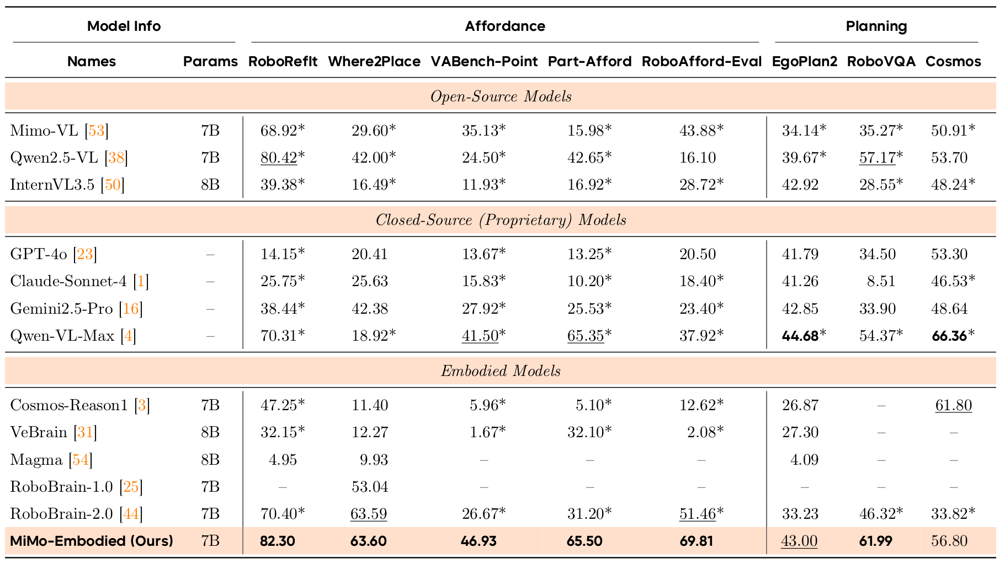
</div>

#### Spatial Understanding

<div align="center">
  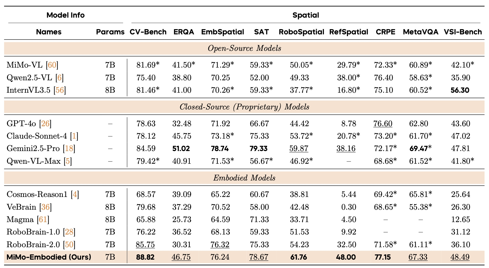
</div>

### Autonomous Driving Benchmarks

#### Single-View Image & Multi-View Video

<div align="center">
  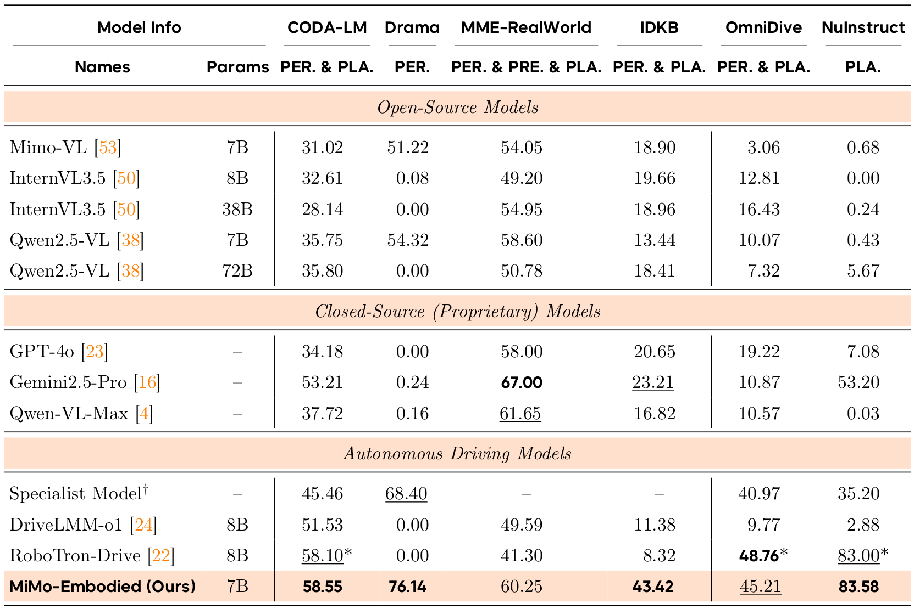
</div>

#### Multi-View Image & Single-View Video

<div align="center">
  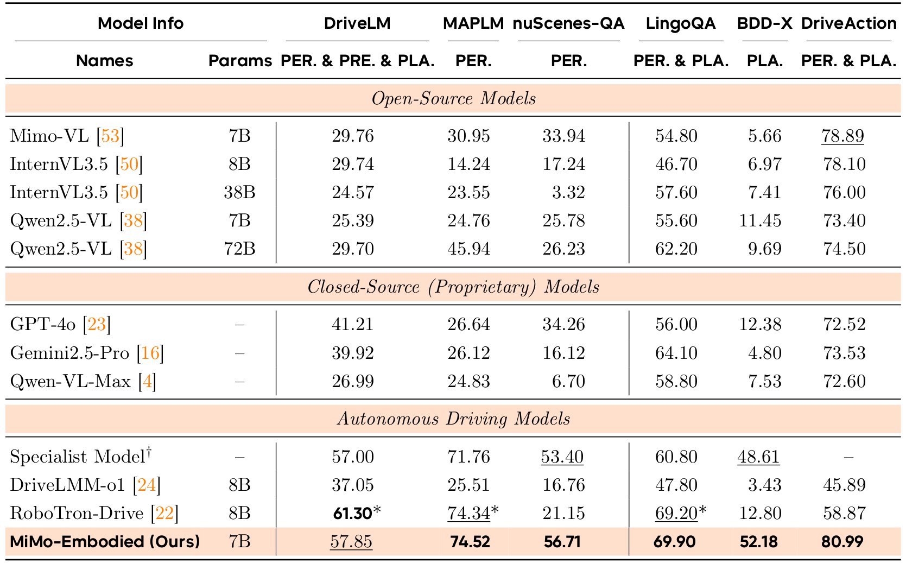
</div>

### General Visual Understanding Benchmarks

<div align="center">
  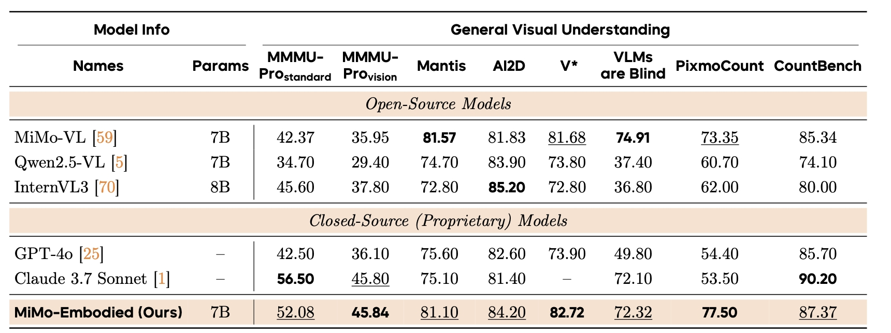
</div>

> Results marked with `*` are obtained using our evaluation framework.

---

## VIII. Metric Definitions

The following table explains how the reported numbers in the evaluation tables are computed from the corresponding `result.json` files.

Unless otherwise specified:

- reported scores are shown in **percentage format**
- percentage scores are computed as `metric × 100`
- if a benchmark contains multiple subtasks, the reported score is the **arithmetic mean** of the corresponding subtask metrics

| Benchmark Name (Table) | Task Name (Eval Script) | Metric in `result.json` | How Table Score Is Computed | Mode | Notes |
|---|---|---|---|---|---|
| `Where2Place` | `where2place_point` | `accuracy` | `accuracy × 100` | think |  |
| `RoboAfford-Eval` | `roboafford` | `accuracy` | `accuracy × 100` | think |  |
| `Part-Afford` | `part_affordance` | `accuracy` | `accuracy × 100` | think |  |
| `RoboRefIt` | `roborefit` | `accuracy` | `accuracy × 100` | think |  |
| `VABench-Point` | `vabench_point_box` | `accuracy` | `accuracy × 100` | think |  |
| `EgoPlan2` | `egoplan` | `accuracy` | `accuracy × 100` | think |  |
| `RoboVQA` | `robovqa` | `robovqa_score` | `robovqa_score × 100` | no-think |  |
| `Cosmos` | `cosmos_reason1_boxed` | `exact_match` from 5 subtasks | `mean(exact_match of 5 subtasks) × 100` | think |  |
| `CV-Bench` | `cvbench_boxed` | `accuracy` | `accuracy × 100` | think |  |
| `ERQA` | `erqa_boxed` | `exact_match` | `exact_match × 100` | think |  |
| `EmbSpatial` | `embspatialbench` | `accuracy` | `accuracy × 100` | think |  |
| `SAT` | `sat` | `accuracy` | `accuracy × 100` | think |  |
| `RoboSpatial` | `robospatial` | `accuracy` from 3 subtasks | `mean(accuracy of 3 subtasks) × 100` | think |  |
| `RefSpatial` | `refspatialbench` | `refspatial-bench-location`, `refspatial-bench-placement` | `mean(refspatial-bench-location, refspatial-bench-placement) × 100` | think |  |
| `CRPE` | `crpe_relation` | `accuracy` | `accuracy × 100` | think |  |
| `MetaVQA` | `metavqa_eval` | `accuracy` | `accuracy × 100` | think |  |
| `VSI-Bench` | `vsibench_boxed` | `vsibench_score` | `vsibench_score × 100` | think |  |
| `CODA-LM` | `codalm` | `jsonl` results for 3 subtasks | Export `jsonl` files for the three subtasks, then follow the official CODA-LM evaluation pipeline to compute the final score | no-think | Official evaluation instructions: <https://github.com/DLUT-LYZ/CODA-LM/tree/main/evaluation> |
| `Drama` | `drama` | `drama_ACC@0.5` | `drama_ACC@0.5 × 100` | think |  |
| `DriveAction` | `drive_action_boxed_detail` | `drive_action_Overall_acc` | `drive_action_Overall_acc × 100` | think |  |
| `LingoQA` | `lingoqa_boxed` | `lingo_judge_acc` | `lingo_judge_acc × 100` | think |  |
| `nuScenes-QA` | `nuscenesqa` | `exist`, `count`, `object`, `status`, `comparison` | `mean(exist, count, object, status, comparison) × 100` | no-think | These category scores are read from `accuracy_extract` in `result.json`. |
| `OmniDrive` | `omnidrive` | `Bleu_1`, `ROUGE_L`, `CIDEr` | `mean(Bleu_1, ROUGE_L, CIDEr) × 100` | no-think |  |
| `NuInstruct` | `nuinstruct` | `bleu` | `bleu × 100` | no-think |  |
| `DriveLM` | `drivelm` | `jsonl` results | Prepare prediction results, then follow the official CODA-LM evaluation pipeline to compute the final score | no-think | Official evaluation instructions: <https://github.com/DLUT-LYZ/CODA-LM/tree/main/evaluation> |
| `MAPLM` | `maplm` | `maplm_FRM`, `maplm_QNS` | `mean(maplm_FRM, maplm_QNS)` | no-think | `maplm_FRM` and `maplm_QNS` are already reported on the 0–100 scale. |
| `BDD-X` | `bddx` | `Bleu_4`, `ROUGE_L`, `CIDEr` | `mean(Bleu_4, ROUGE_L, CIDEr) × 100` | no-think |  |
| `MME-RealWorld` | `mme_realworld` | `mme_realworld_score` from 2 subtasks | `mean(mme_realworld_score of 2 subtasks) × 100` | think |  |
| `IDKB` | `idkb` | Metrics from 6 subtasks | `mean(IDKB_multi_no_image_val, IDKB_multi_with_image_val, IDKB_qa_no_image_val, IDKB_qa_with_image_val, IDKB_single_no_image_val, IDKB_single_with_image_val)` | no-think | Subtask scores are computed as follows: `IDKB_multi_no_image_val = acc × 100`; `IDKB_multi_with_image_val = acc × 100`; `IDKB_qa_no_image_val = mean(rouge_1, rouge_l, semscore)`; `IDKB_qa_with_image_val = mean(rouge_1, rouge_l, semscore)`; `IDKB_single_no_image_val = acc × 100`; `IDKB_single_with_image_val = acc × 100`. |

For complete metric definitions and task-specific details, please refer to `mimovl_docs/tasks.md`.
---

## IX. Case Visualization

### Embodied AI

#### Affordance Prediction

<div align="center">
  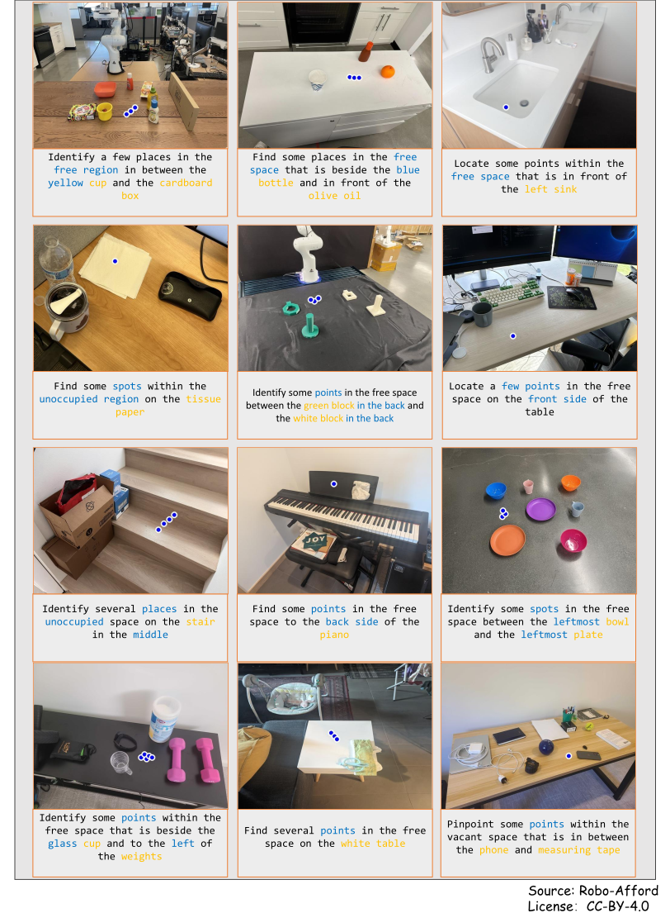
</div>

#### Task Planning

<div align="center">
  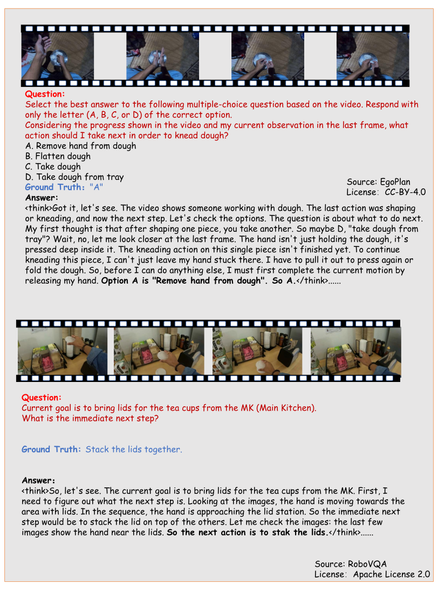
</div>

#### Spatial Understanding

<div align="center">
  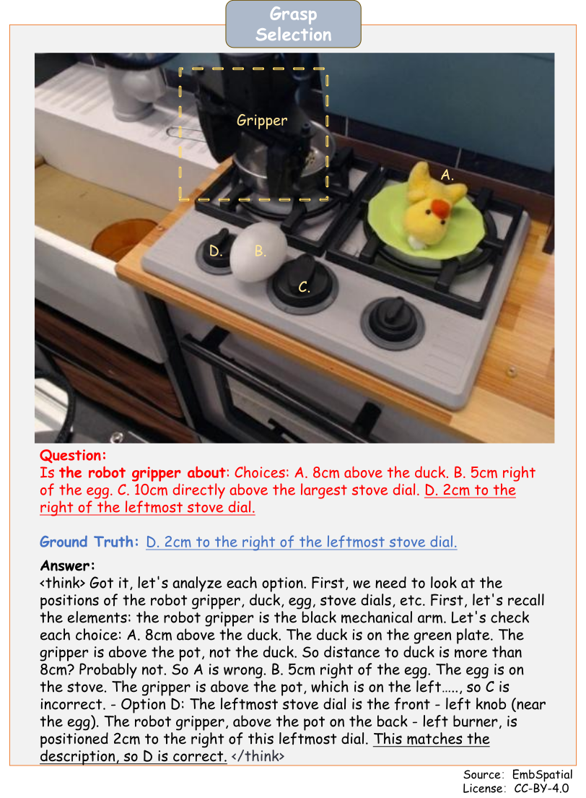
</div>

### Autonomous Driving

#### Environmental Perception

<div align="center">
  
</div>

#### Status Prediction

<div align="center">
  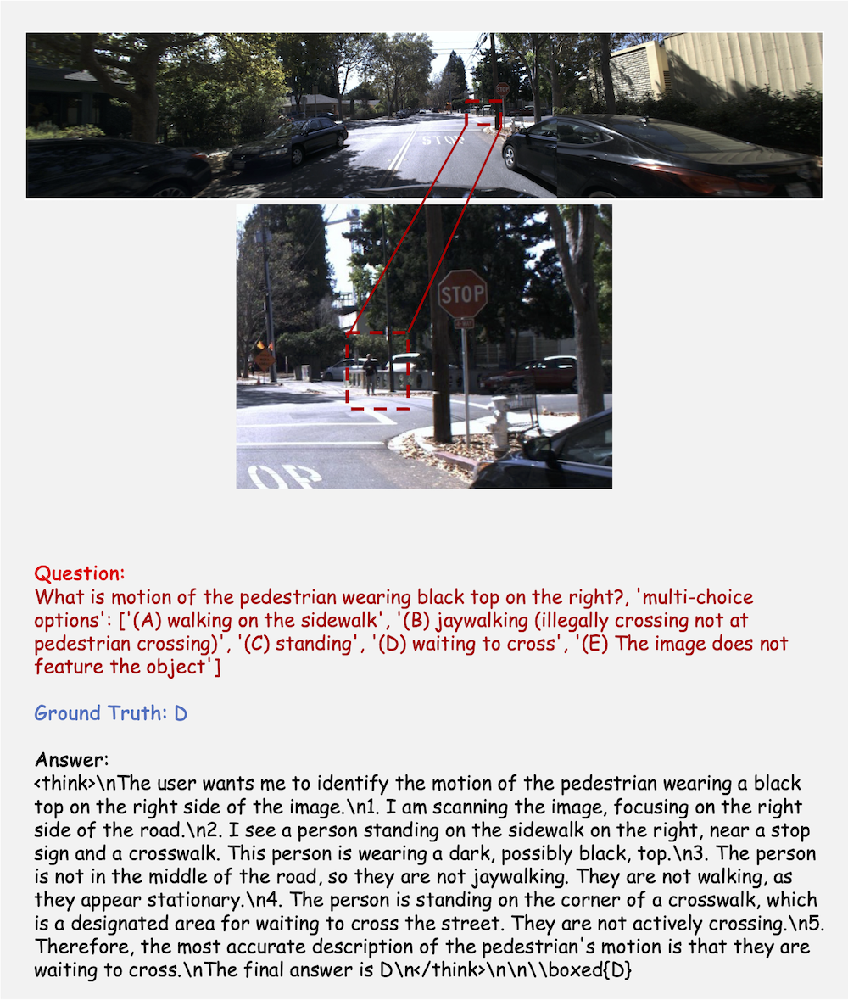
</div>

#### Driving Planning

<div align="center">
  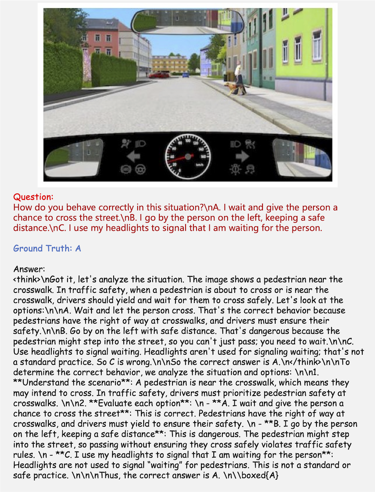
</div>

### Real-world Tasks

#### Embodied Navigation

<div align="center">
  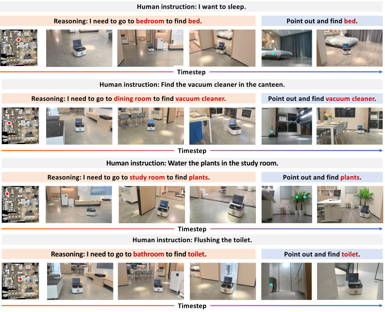
</div>

#### Embodied Manipulation

<div align="center">
  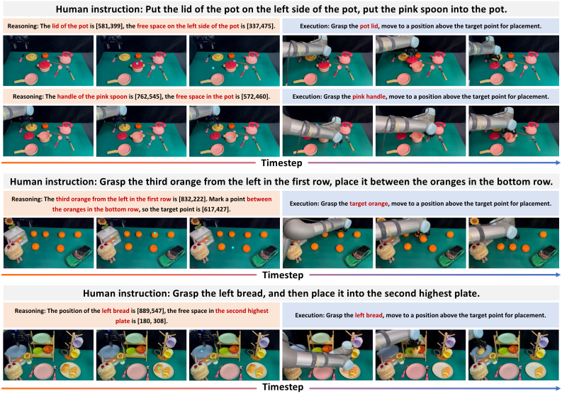
</div>

---

## X. Repository Structure

```text
.
├── lmms_eval/                # Core evaluation framework
│   ├── models/               # Model adapters, including mivllm
│   ├── tasks/                # Task definitions and configs
│   ├── api/                  # API interfaces
│   └── ...
├── mimovl_docs/
│   ├── eval_mimo_vl_args.sh  # Main evaluation launcher
│   └── tasks.md              # Task documentation
├── tools/submit/             # Batch evaluation runners
├── patches/                  # Environment patches
├── assets/                   # README assets
├── requirements.txt
├── setup.py
├── pyproject.toml
└── README.md
```

---

## XI. Citation

```bibtex
@misc{hao2025mimoembodiedxembodiedfoundationmodel,
      title={MiMo-Embodied: X-Embodied Foundation Model Technical Report}, 
      author={Xiaomi Embodied Intelligence Team},
      year={2025},
      eprint={2511.16518},
      archivePrefix={arXiv},
      primaryClass={cs.RO},
      url={https://arxiv.org/abs/2511.16518}, 
}

@misc{mimoembodiedeval2025,
      title={The Evaluation Suite of Xiaomi MiMo-Embodied},
      author={Xiaomi Embodied Intelligence Team},
      year={2025},
      url={https://github.com/XiaomiMiMo/MiMo-Embodied}
}
```